<p float="left">
  
  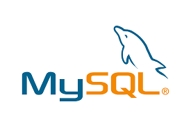
  
</p>

## Spring Boot MySQL, Security, Thymeleaf

### Description
The dice game is played with two dice. If the result of the sum of the two dice is 7, the game is won, if not lost. A player can see a list of all the rolls he/she has made and the percentage of success.

To be able to play the game and make a roll, a user must register with a non-repeated name. Upon creation, it is assigned a unique numeric identifier and a registration date. If the user so wishes, you can not add a name and it will be called "ANONYMOUS". There can be more than one "ANONYMOUS" player.
Each player can see a list of all the rolls they have made, with the value of each die and whether or not they have won the game. In addition, you can know your success rate for all the rolls you have made.

You cannot delete a specific game, but you can delete the entire list of runs for a player.

The software must be able to list all the players in the system, the success percentage of each player and the average success percentage of all the players in the system.

The software must respect the main design patterns.

**URL's** 

    Frontend: /page                     security
    - GET:    /home                     "isAnonymous()"
    - GET:    /home                     "isAthenticated()"

    - GET:    /login    ?error ?logout  "permitAll"
    - GET:    /register ?error          "permitAll"

    - GET:    /players                  "isAthenticated()"

    - GET:    /adminArea                "hasAuthority('ADMIN')"


    Backend:  /page
    - POST:   /actionRegister           -> Create a player.                 return: "redirect:/page/login?registrado=true"
    - PUT     /update/{id}              -> change the name of the player.   return: "register"
    - GET     /delete/{id}              -> deletes the player's rolls.      return: "redirect:/page/adminArea"


<hr>


### Home page``` /page/home```
*Login and Register in only visible if you are not authorized*


Home page without login 
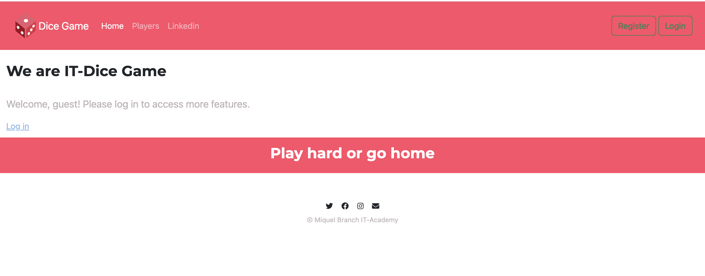
Home page for players
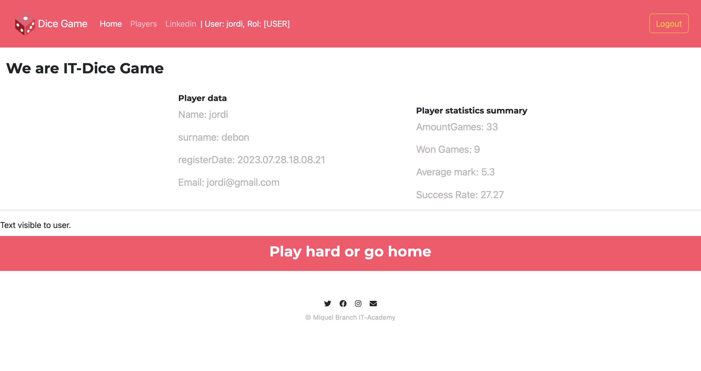
Home page for Admin *'AdminArea only visible'*
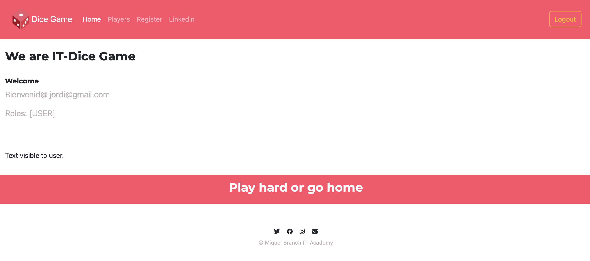

<hr>

### Login page ``` /page/login```
Login
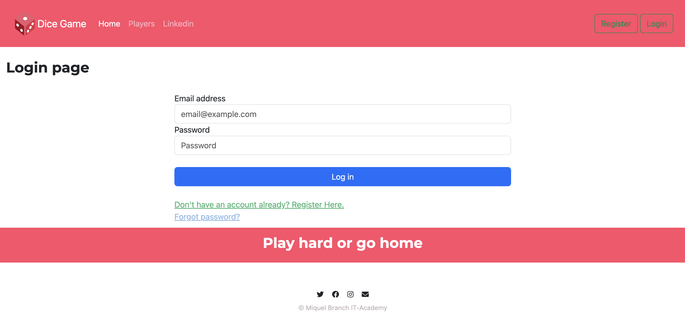
Logout
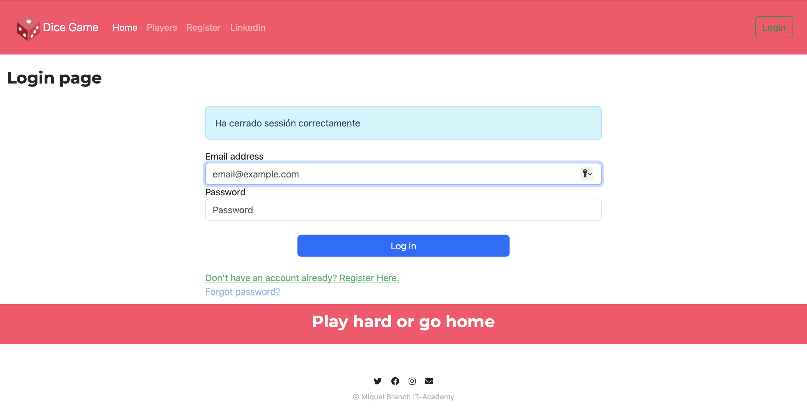
Login Rejected
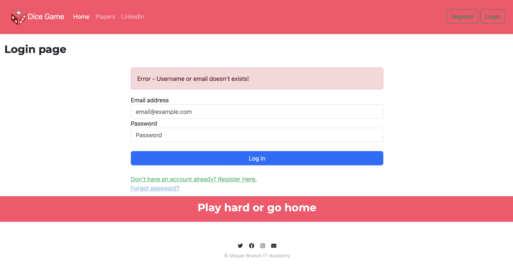
Login <- from Success register
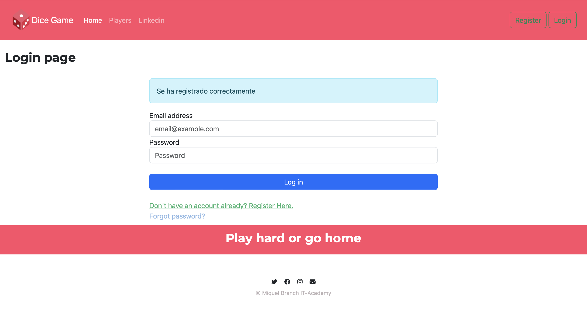

<hr>

### Register page ``` /page/register```
Register
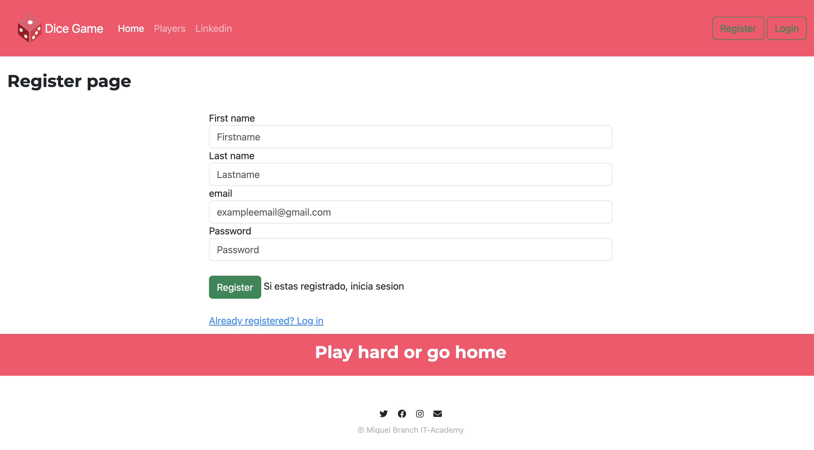
Register rejected by **duplicated name**
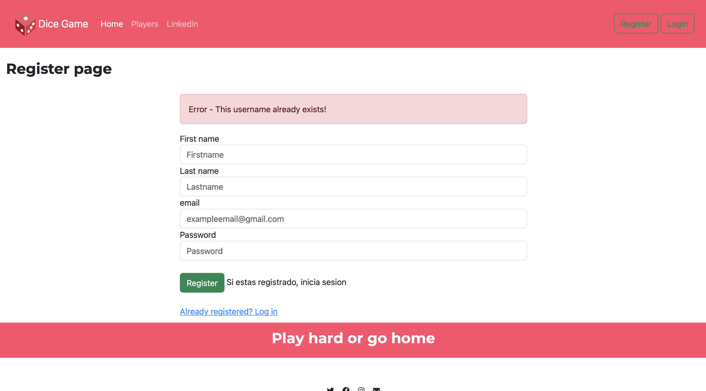
Register rejected by **duplicated email**
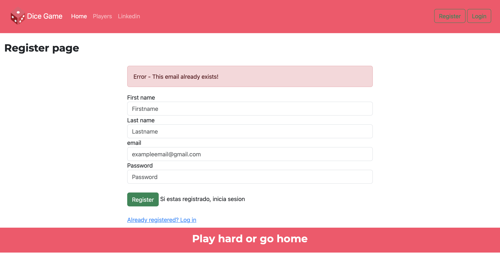

<hr>

### Players ``` /page/players```  
```"isAthenticated()"```*Any user or admin can play*

Players page default
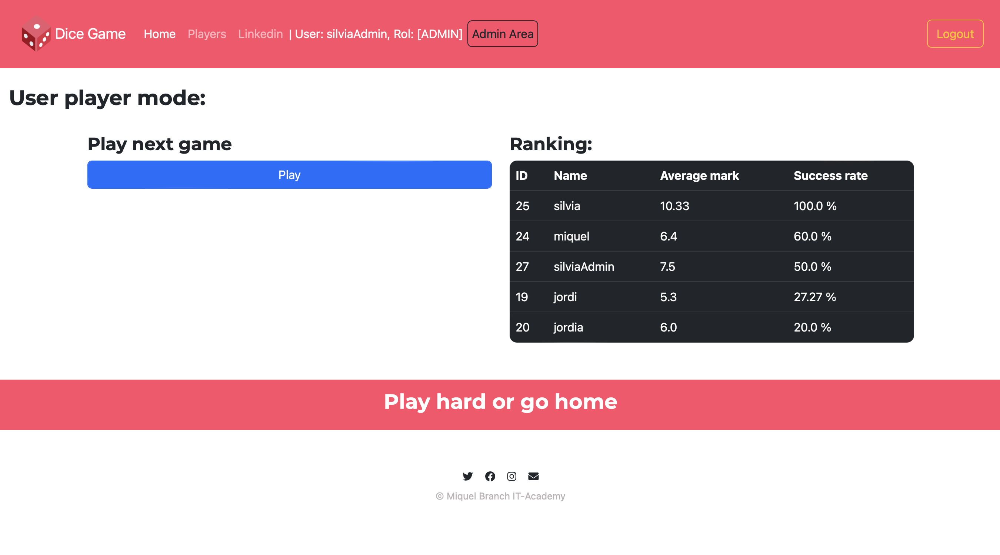
Players page at playing

*From where you can see you previous history rounds*
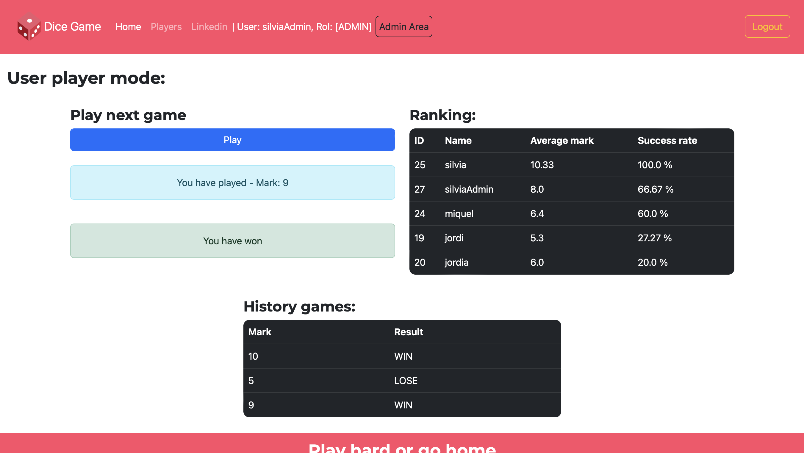

<hr>

### Admin ``` /admin/home```   
```"hasAuthority('ADMIN')"```*As an admin you can edit, play or delete the games from any other player*

Admin Area
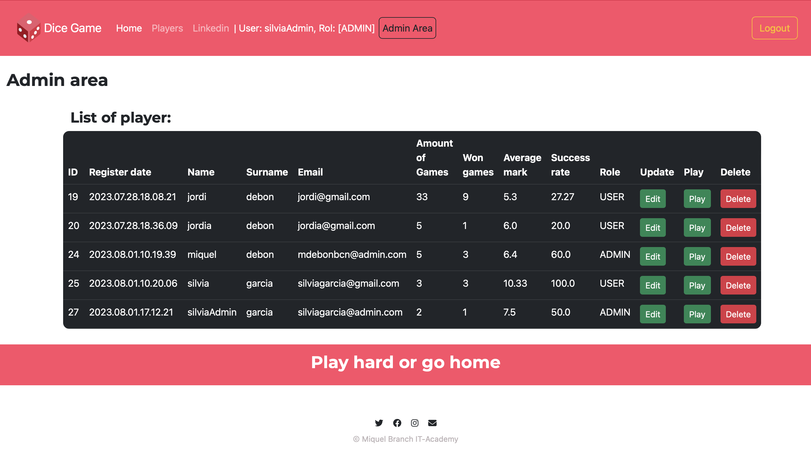
Delete alert
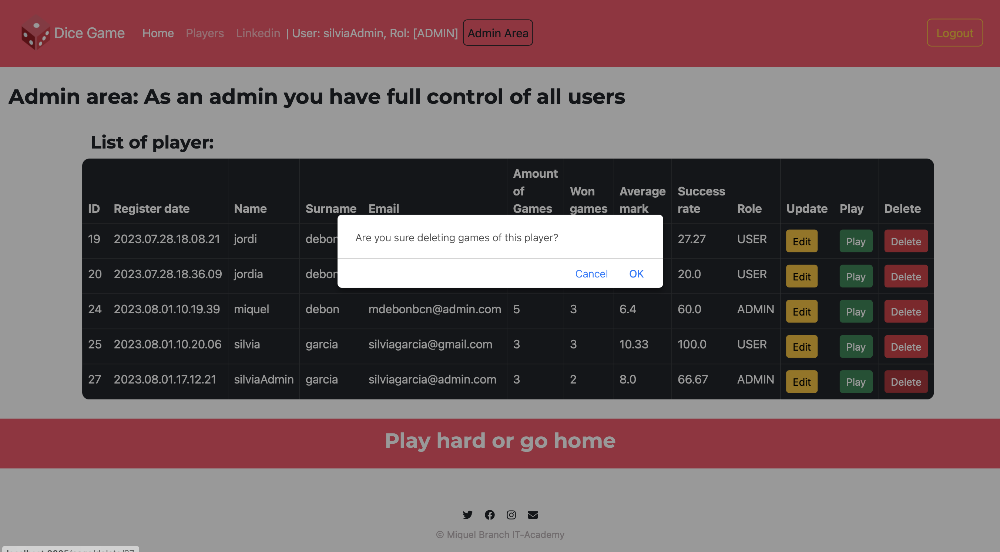


### References:
- [spring-boot-spring-security-thymeleaf-example](https://mkyong.com/spring-boot/spring-boot-spring-security-thymeleaf-example/)
- [Spring Security – Authentication Providers](https://www.geeksforgeeks.org/spring-security-authentication-providers/)
- [Spring MVC Tutorial Project For Beginners | Teddy Smith](https://www.youtube.com/playlist?list=PL82C6-O4XrHejlASdecIsroNEbZFYo_X1)
- [Complete End-to-End Spring MVC Web Application | Spring Boot 3 | Spring Security 6 | Thymeleaf. #3](https://www.youtube.com/watch?v=OmQPR1RwZ38)
- [Inicio de sesión y registro de usuarios con Spring Security + Thymeleaf + MySQL y Bootstrap](https://www.youtube.com/watch?v=0wTsLRxS3gA)
- [Spring Boot 3 + Spring Security 6 - JWT Authentication and Authorisation [NEW] [2023]](https://www.youtube.com/watch?v=KxqlJblhzfI&t=5691s)


