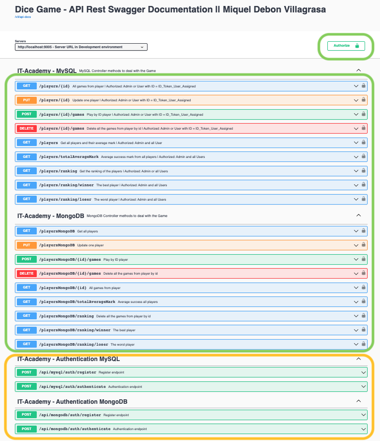
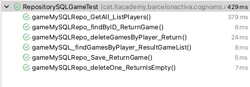
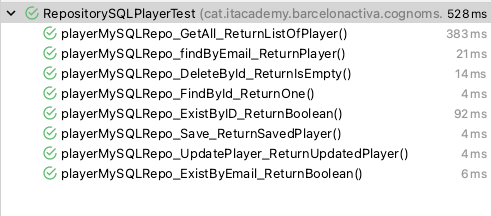
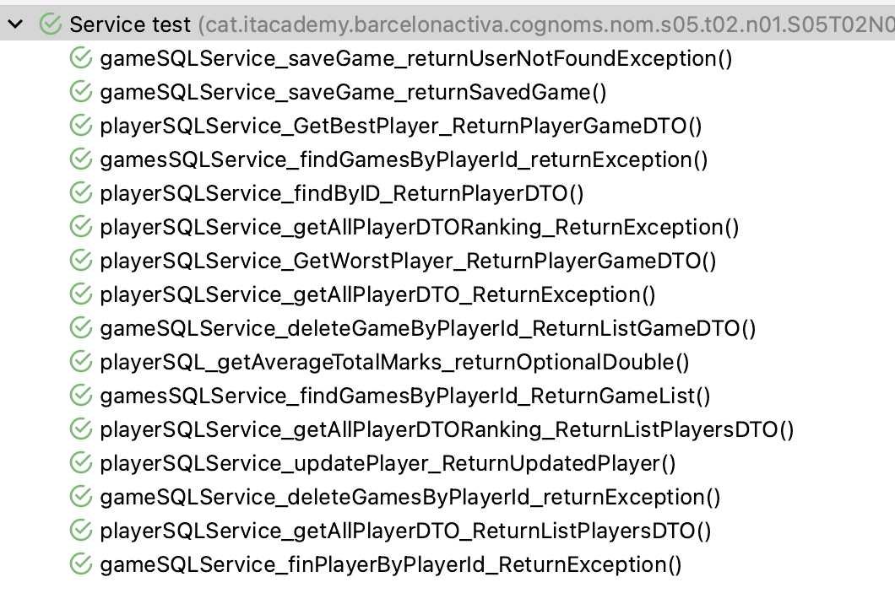
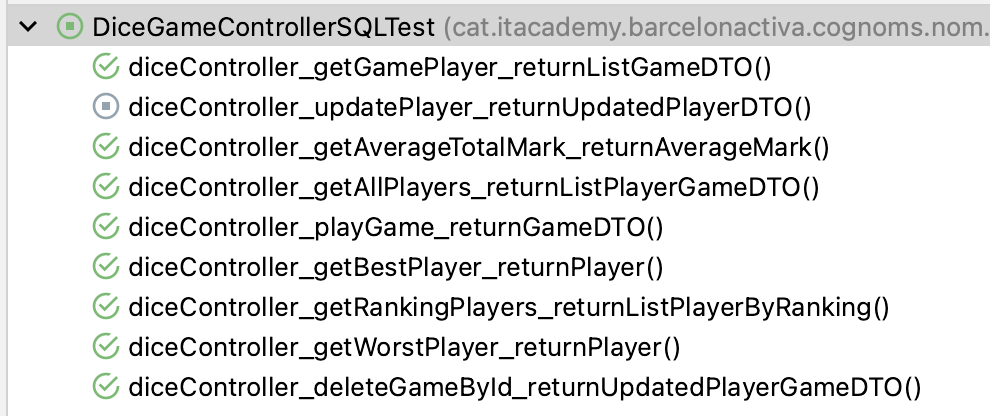
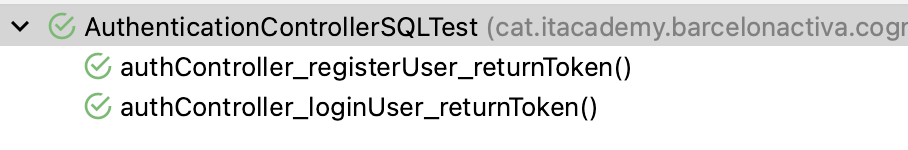

<p float="left">
  
   
  
  
</p>

## Spring Boot MySQL, Security, Thymeleaf

### Description
The dice game is played with two dice. If the result of the sum of the two dice is 7, the game is won, if not lost. A player can see a list of all the rolls he/she has made and the percentage of success.

To be able to play the game and make a roll, a user must register with a non-repeated name. Upon creation, it is assigned a unique numeric identifier and a registration date. If the user so wishes, you can not add a name and it will be called "ANONYMOUS". There can be more than one "ANONYMOUS" player.
Each player can see a list of all the rolls they have made, with the value of each die and whether or not they have won the game. In addition, you can know your success rate for all the rolls you have made.

You cannot delete a specific game, but you can delete the entire list of runs for a player.

The software must be able to list all the players in the system, the success percentage of each player and the average success percentage of all the players in the system.

The software must respect the main design patterns.

**URL's** 

    MYSQL:    /players
    MongoDB   /playersMongoDB

    - POST:   /players                -> Create a player.
    - PUT     /players                -> change the name of the player.
    - POST    /players/{id}/games/    -> A specific player rolls the dice.
    - DELETE  /players/{id}/games     -> deletes the player's rolls.
    - GET     /players/               -> returns the list of all the players in the system with their average success rate.
    - GET     /players/{id}/games     -> returns the list of games for a player.
    - GET     /players/ranking        -> returns the average ranking of all players in the system. That is, the average percentage of successes.
    - GET     /players/ranking/loser  -> returns the player with the worst success rate.
    - GET     /players/ranking/winner -> returns the player with the worst success rate.

Endpoints filter by pre-authorization:
```
By ROLE: The role assigned to the user related to the JWT token
@PreAuthorize("hasAuthority('ADMIN')")
@PreAuthorize("hasAuthority('USER') or hasAuthority('ADMIN')")

By ID: Where the ID must be the same that the id of the user related to the JWT token
@PreAuthorize("#id == authentication.principal.id")

By ID or ROLE: 
@PreAuthorize("#id == authentication.principal.id or hasAuthority('ADMIN')")

```
### Swagger summary 



### References:
- JPA entity relationships
  - [Bezkoder](https://www.bezkoder.com/jpa-one-to-many/) 
  - [Tutorialspoint](https://www.tutorialspoint.com/jpa/jpa_entity_relationships.htm)
- [JPA custom queries - Bezkoder](https://www.bezkoder.com/jpa-repository-query/)
- [Swagger - Bezkoder](https://www.bezkoder.com/swagger-3-annotations/)
- Testing
  - Arrange Act Assert
  - [Spring Boot Unit Testing Tutorial (W/ Mockito) - Teddy Smith](https://www.youtube.com/playlist?list=PL82C6-O4XrHcg8sNwpoDDhcxUCbFy855E)
  - [Writing JUnit Tests using JUnit and Mockito | Java Techie](https://www.youtube.com/watch?v=kXhYu939_5s)
  - [PRUEBAS de INTEGRACIÓN en SPRING BOOT | Programando en Java](https://www.youtube.com/watch?v=fEv3AXFqLXg)
  - [Learn Unit Testing and Integration Testing | AmigosCode](https://www.youtube.com/watch?v=Geq60OVyBPg)
  - [@DataJpaTest example for Spring Data Repository Unit Test | Bezkoder](https://www.bezkoder.com/spring-boot-unit-test-jpa-repo-datajpatest/)
  
- JWT - SpringBoot Security
  - [Bezkoder - Spring Boot Token based Authentication with Spring Security & JWT](https://www.bezkoder.com/spring-boot-jwt-authentication/)
  - [Amigoscode - Spring Boot 3 + Spring Security 6 - JWT Authentication and Authorisation [NEW] [2023]](https://www.youtube.com/watch?v=KxqlJblhzfI&t=1040s)
  - [Bezkoder - Spring Boot 2 JWT Authentication with Spring Security](https://www.bezkoder.com/spring-boot-jwt-mysql-spring-security-architecture/)
  - [PreAuthorization](https://docs.spring.io/spring-security/site/docs/5.0.7.RELEASE/reference/html/el-access.html)
  
- More Swagger
  - [Swagger 3 annotations in Spring Boot](https://www.bezkoder.com/swagger-3-annotations/#Swagger_3_ApiResponses_and_ApiResponse_annotation)
  - [Spring Boot + Swagger 3 example (with OpenAPI 3) - Advanced](https://www.bezkoder.com/spring-boot-swagger-3/)

- Exception Handler
  - [REST API Request Validation & Exception Handling Realtime Example | JavaTechie](https://www.youtube.com/watch?v=gPnd-hzM_6A)
  - [How To Handle Exceptions | Amigoscode](https://www.youtube.com/watch?v=PzK4ZXa2Tbc)
  - [Spring Boot @ControllerAdvice & @ExceptionHandler example | Bezkoder](https://www.bezkoder.com/spring-boot-controlleradvice-exceptionhandler/)


### Testing 

<table>
   <tr>
      <td><p>Repository Game SQL</p></td>
      <td><p>Repository Player SQL</p></td>
   </tr>
   <tr>
      <td> 
      
      </td>
      <td>
      
      </td>
   </tr>
    <tr>
      <td><p>Dice Game Services SQL </p></td>
      <td><p>-</p></td>
   </tr>
    <tr>
      <td> 
      
      </td>
      <td>
      
      </td>
   </tr>

  </tr>
    <tr>
      <td><p>Controller Dice Game SQL </p></td>
      <td><p>Controller Authoritzation SQL</p></td>
   </tr>
    <tr>
      <td> 
      
      </td>
      <td>
      
      </td>
   </tr>
 

</table>